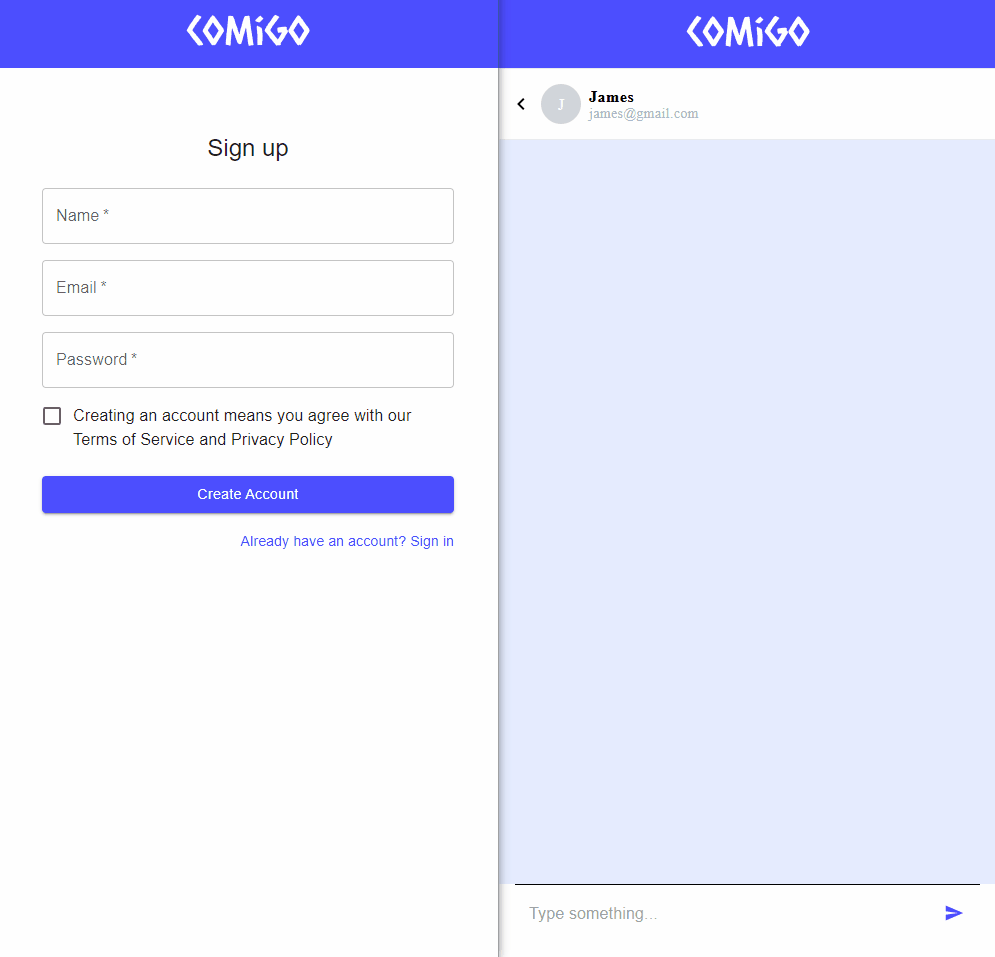

# Comigo Chat App

> A simple, multi-user text-based chat app.

<p align="center">
  
</p>

This is a Typescript [Vite](https://vitejs.dev/) app using Firebase for the backend and is deployed to Vercel [here](https://comigo.vercel.app).

User can register an account, select and chat with the other users who have registered. The app has public and private pages and you must be logged in to access the chat page.

The app was written using `eslint` standards, `prettier` for formatting the code, and conventional commits.

## Run the project locally

The project dependencies are managed by `npm`.

1. Clone the project.
2. Install dependencies.
3. Create a new Web Google Firebase project: [https://console.firebase.google.com/](https://console.firebase.google.com/).
4. Create and enable both the `Firestore Database` and `Realtime Database`.
5. Under the Firebase project's settings, scroll down to add a new Web page app
6. Locate the `firebaseConfig` sample JS code with all the API key/config data. Looks like this:

```
const firebaseConfig = {
  apiKey: "xxx",
  authDomain: "xxx",
  projectId: "xxx",
  storageBucket: "xxx",
  messagingSenderId: "xxx",
  appId: "xxx",
  databaseURL: "xxx"
};
```

7. Create a `.env` environment variable file in the top level directory of the cloned project on your computer and copy/paste all the config data into it assigned to variables named as the following:

```
VITE_FIREBASE_API_KEY=xxx
VITE_FIREBASE_AUTH_DOMAIN=xxx
VITE_FIREBASE_PROJECT_ID=xxx
VITE_FIREBASE_STORAGE_BUCKET=xxx
VITE_FIREBASE_MESSAGING_SENDER_ID=xxx
VITE_FIREBASE_APP_ID=xxx
VITE_FIREBASE_DATABASE_URL=xxx
```

Then `src/firebaseConfig.ts` should be able to read them when you run the project.

8. Run `npm run dev` to launch the project locally in your web browser. If you get a Firebase error, check the `Rules` tab of both the `Firestore Database` and `Realtime Database` to make sure the project has the read/write permissions set to "true".

## Contributing/setup for local development

1. Go through the steps above for running the project locally.
2. Enable `husky` pre-commit hooks: `npx husky install`

We use the pre-commit hooks to run `eslint` and require conventional commit formats. You can test that `husky` is working by trying to commit code using a message format unacceptable to conventional commits.
